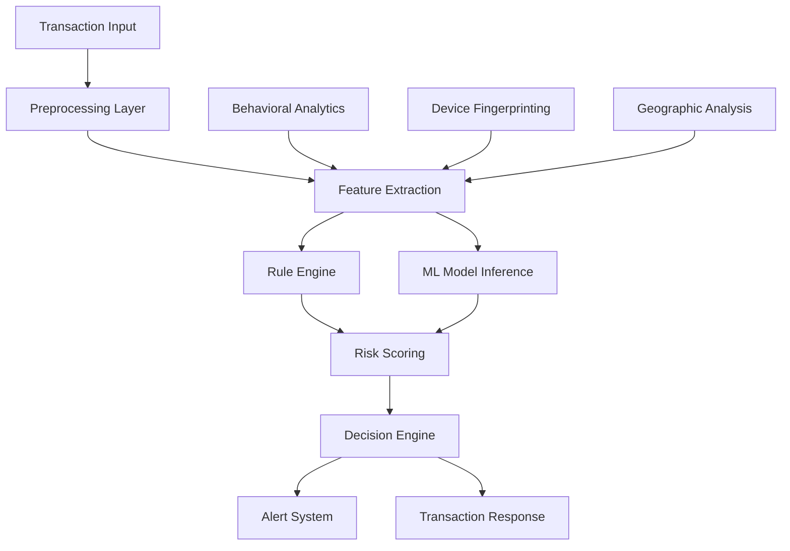

# Fraud Detection System Design

## Overview

The fraud detection system is designed as a real-time, event-driven architecture that processes financial transactions through multiple analysis layers. The system combines rule-based detection with machine learning models to achieve high accuracy while maintaining sub-100ms response times.

## Architecture



## Components and Interfaces

### 1. Transaction Processor

- **Purpose**: Entry point for all transaction analysis
- **Interface**: `ITransactionProcessor`
- **Key Methods**:
  - `analyzeTransaction(transaction: Transaction): Promise<RiskAssessment>`
  - `processInRealTime(transactionStream: Stream<Transaction>): void`

### 2. Feature Extraction Engine

- **Purpose**: Extracts relevant features from transaction data
- **Interface**: `IFeatureExtractor`
- **Key Methods**:
  - `extractFeatures(transaction: Transaction): FeatureVector`
  - `enrichWithBehavioralData(features: FeatureVector, userId: string): FeatureVector`

### 3. Risk Scoring Engine

- **Purpose**: Combines multiple risk signals into unified score
- **Interface**: `IRiskScorer`
- **Key Methods**:
  - `calculateRiskScore(features: FeatureVector): RiskScore`
  - `updateRiskThresholds(newThresholds: RiskThresholds): void`

### 4. Machine Learning Service

- **Purpose**: Provides ML-based fraud predictions
- **Interface**: `IMLService`
- **Key Methods**:
  - `predict(features: FeatureVector): Promise<MLPrediction>`
  - `updateModel(trainingData: TrainingData[]): Promise<void>`

### 5. Device Intelligence Service

- **Purpose**: Provides comprehensive device analysis and fingerprinting
- **Interface**: `IDeviceIntelligenceService`
- **Key Methods**:
  - `analyzeDevice(fingerprint: DeviceFingerprint, userId: string): Promise<DeviceAnalysis>`
  - `getDeviceIntelligence(deviceId: string): Promise<DeviceIntelligence>`
  - `trackDeviceChanges(userId: string): Promise<DeviceChangeEvent[]>`
  - `calculateTrustScore(deviceId: string, userId: string): Promise<number>`
  - `detectSuspiciousPatterns(fingerprint: DeviceFingerprint): Promise<string[]>`

### 6. Security Dashboard Service

- **Purpose**: Aggregates security metrics and device intelligence for dashboard display
- **Interface**: `ISecurityDashboardService`
- **Key Methods**:
  - `getSecurityOverview(userId: string): Promise<SecurityOverview>`
  - `getDeviceTrustMetrics(userId: string): Promise<DeviceTrustMetrics>`
  - `getNetworkSecurityStatus(userId: string): Promise<NetworkSecurityStatus>`
  - `getBehaviorScore(userId: string): Promise<BehaviorScore>`
  - `getDeviceChangeTimeline(userId: string): Promise<DeviceChangeEvent[]>`

## Data Models

### Transaction

```typescript
interface Transaction {
  id: string;
  userId: string;
  amount: number;
  currency: string;
  timestamp: Date;
  merchantId?: string;
  location: GeoLocation;
  deviceInfo: DeviceFingerprint;
  transactionType: TransactionType;
}
```

### RiskAssessment

```typescript
interface RiskAssessment {
  transactionId: string;
  riskScore: number; // 0-100
  riskLevel: "LOW" | "MEDIUM" | "HIGH" | "CRITICAL";
  riskFactors: RiskFactor[];
  recommendation: "APPROVE" | "REVIEW" | "BLOCK";
  confidence: number;
  processingTime: number;
}
```

### DeviceFingerprint

```typescript
interface DeviceFingerprint {
  deviceId: string;
  userAgent: string;
  screenResolution: string;
  colorDepth: number;
  timezone: string;
  language: string;
  languages: string[];
  platform: string;
  cookieEnabled: boolean;
  doNotTrack: string | null;
  ipAddress: string;
  networkType: string;
  hardwareConcurrency: number;
  maxTouchPoints: number;
  canvas: string;
  webgl: string;
  fonts: string[];
  plugins: string[];
  localStorage: boolean;
  sessionStorage: boolean;
  indexedDB: boolean;
  cpuClass?: string;
  deviceMemory?: number;
  pixelRatio: number;
  touchSupport: boolean;
  audioContext: string;
  webRTC: string;
  battery?: {
    charging: boolean;
    level: number;
    chargingTime: number;
    dischargingTime: number;
  };
  timestamp?: Date;
}

interface DeviceAnalysis {
  trustScore: number;
  riskLevel: "LOW" | "MEDIUM" | "HIGH" | "CRITICAL";
  changeAnalysis: DeviceChangeAnalysis;
  recommendations: string[];
  securityFlags: string[];
  deviceConsistency: number;
  lastSeen: Date;
  fingerprintStability: number;
  suspiciousActivityCount: number;
}

interface DeviceChangeAnalysis {
  hasSignificantChanges: boolean;
  changeScore: number;
  changedComponents: string[];
  riskLevel: "LOW" | "MEDIUM" | "HIGH" | "CRITICAL";
  details: Record<string, any>;
  suspiciousPatterns: string[];
  timeline: DeviceChangeEvent[];
}

interface DeviceChangeEvent {
  timestamp: Date;
  changeType: "HARDWARE" | "SOFTWARE" | "NETWORK" | "BEHAVIOR";
  severity: "LOW" | "MEDIUM" | "HIGH";
  component: string;
  previousValue: any;
  currentValue: any;
  riskImpact: number;
  description: string;
}

interface DeviceIntelligence {
  deviceProfile: DeviceProfile;
  behaviorAnalysis: BehaviorAnalysis;
  networkAnalysis: NetworkAnalysis;
  hardwareAnalysis: HardwareAnalysis;
}

interface DeviceProfile {
  isKnownDevice: boolean;
  deviceAge: number; // days since first seen
  usageFrequency: number;
  transactionCount: number;
  lastActivity: Date;
  deviceCategory: "MOBILE" | "DESKTOP" | "TABLET" | "UNKNOWN";
}

interface BehaviorAnalysis {
  typingPatterns: TypingPattern[];
  mouseMovements: MousePattern[];
  touchPatterns: TouchPattern[];
  sessionDuration: number;
  interactionFrequency: number;
  automationScore: number;
}

interface NetworkAnalysis {
  ipHistory: IPHistoryEntry[];
  locationConsistency: number;
  vpnDetection: VPNDetection;
  networkStability: number;
  connectionQuality: ConnectionQuality;
}

interface HardwareAnalysis {
  hardwareConsistency: number;
  performanceProfile: PerformanceProfile;
  capabilityChanges: CapabilityChange[];
  spoofingIndicators: SpoofingIndicator[];
}
```

## Error Handling

### 1. Timeout Handling

- Transactions must be processed within 200ms hard limit
- If processing exceeds limit, default to APPROVE with logging
- Implement circuit breaker pattern for external services

### 2. Model Failure Handling

- Fallback to rule-based detection if ML models fail
- Graceful degradation with reduced accuracy warnings
- Automatic model health monitoring and alerts

### 3. Data Quality Issues

- Validate input data completeness and format
- Handle missing features with default values
- Log data quality issues for model improvement

## Security Dashboard Components

### 1. Device Trust Score Card

Displays real-time device trust metrics and risk assessment.

**Features:**

- Trust score visualization (0-100)
- Risk level indicator with color coding
- Device consistency metrics
- Last seen timestamp
- Suspicious activity alerts

### 2. Device Information Panel

Shows comprehensive device fingerprint analysis.

**Features:**

- Hardware profile (screen, CPU, memory)
- Browser environment details
- Network and location information
- Device capability analysis
- Fingerprint stability metrics

### 3. Device Change Timeline

Interactive timeline showing device changes and security events.

**Features:**

- Chronological change history
- Change severity indicators
- Component-specific change details
- Risk impact assessment
- Filtering by change type

### 4. Network Security Analysis

Displays network-based security intelligence.

**Features:**

- IP address history and geolocation
- VPN/Proxy detection
- Network consistency analysis
- Connection quality metrics
- Location-based risk assessment

### 5. Behavioral Analysis Dashboard

Shows user behavior patterns and anomaly detection.

**Features:**

- Interaction pattern analysis
- Automation detection scores
- Session behavior metrics
- Typing and mouse patterns
- Mobile vs desktop usage

### 6. Security Alerts Panel

Real-time security alerts and recommendations.

**Features:**

- Critical security flags
- Automated recommendations
- Alert severity classification
- Action buttons for security responses
- Alert history and resolution tracking

## Testing Strategy

### 1. Unit Testing

- Test individual components with mock data
- Validate risk scoring algorithms with known scenarios
- Test error handling and edge cases

### 2. Integration Testing

- End-to-end transaction processing flows
- ML model integration and fallback scenarios
- Performance testing under load

### 3. A/B Testing

- Compare new models against production baselines
- Gradual rollout of model updates
- Monitor false positive/negative rates

### 4. Security Testing

- Validate data encryption and secure transmission
- Test against known fraud patterns
- Penetration testing for system vulnerabilities
