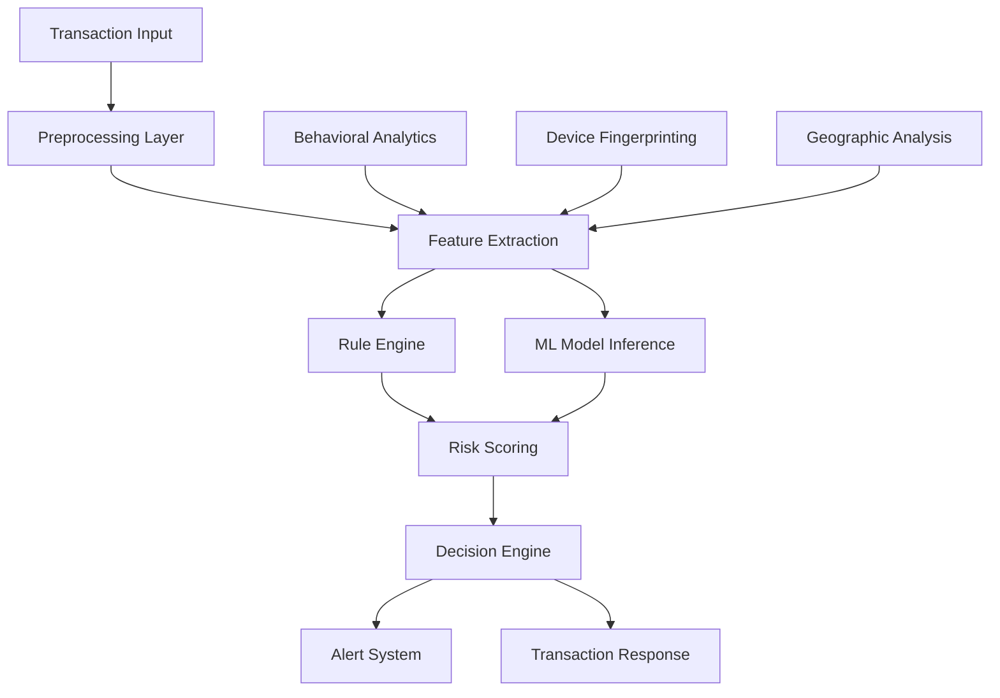

# Fraud Detection System Design

## Overview

The fraud detection system is designed as a real-time, event-driven architecture that processes financial transactions through multiple analysis layers. The system combines rule-based detection with machine learning models to achieve high accuracy while maintaining sub-100ms response times.

## Architecture



## Components and Interfaces

### 1. Transaction Processor

- **Purpose**: Entry point for all transaction analysis
- **Interface**: `ITransactionProcessor`
- **Key Methods**:
  - `analyzeTransaction(transaction: Transaction): Promise<RiskAssessment>`
  - `processInRealTime(transactionStream: Stream<Transaction>): void`

### 2. Feature Extraction Engine

- **Purpose**: Extracts relevant features from transaction data
- **Interface**: `IFeatureExtractor`
- **Key Methods**:
  - `extractFeatures(transaction: Transaction): FeatureVector`
  - `enrichWithBehavioralData(features: FeatureVector, userId: string): FeatureVector`

### 3. Risk Scoring Engine

- **Purpose**: Combines multiple risk signals into unified score
- **Interface**: `IRiskScorer`
- **Key Methods**:
  - `calculateRiskScore(features: FeatureVector): RiskScore`
  - `updateRiskThresholds(newThresholds: RiskThresholds): void`

### 4. Machine Learning Service

- **Purpose**: Provides ML-based fraud predictions
- **Interface**: `IMLService`
- **Key Methods**:
  - `predict(features: FeatureVector): Promise<MLPrediction>`
  - `updateModel(trainingData: TrainingData[]): Promise<void>`

## Data Models

### Transaction

```typescript
interface Transaction {
  id: string;
  userId: string;
  amount: number;
  currency: string;
  timestamp: Date;
  merchantId?: string;
  location: GeoLocation;
  deviceInfo: DeviceFingerprint;
  transactionType: TransactionType;
}
```

### RiskAssessment

```typescript
interface RiskAssessment {
  transactionId: string;
  riskScore: number; // 0-100
  riskLevel: "LOW" | "MEDIUM" | "HIGH" | "CRITICAL";
  riskFactors: RiskFactor[];
  recommendation: "APPROVE" | "REVIEW" | "BLOCK";
  confidence: number;
  processingTime: number;
}
```

### DeviceFingerprint

```typescript
interface DeviceFingerprint {
  deviceId: string;
  userAgent: string;
  screenResolution: string;
  timezone: string;
  language: string;
  ipAddress: string;
  networkType: string;
}
```

## Error Handling

### 1. Timeout Handling

- Transactions must be processed within 200ms hard limit
- If processing exceeds limit, default to APPROVE with logging
- Implement circuit breaker pattern for external services

### 2. Model Failure Handling

- Fallback to rule-based detection if ML models fail
- Graceful degradation with reduced accuracy warnings
- Automatic model health monitoring and alerts

### 3. Data Quality Issues

- Validate input data completeness and format
- Handle missing features with default values
- Log data quality issues for model improvement

## Testing Strategy

### 1. Unit Testing

- Test individual components with mock data
- Validate risk scoring algorithms with known scenarios
- Test error handling and edge cases

### 2. Integration Testing

- End-to-end transaction processing flows
- ML model integration and fallback scenarios
- Performance testing under load

### 3. A/B Testing

- Compare new models against production baselines
- Gradual rollout of model updates
- Monitor false positive/negative rates

### 4. Security Testing

- Validate data encryption and secure transmission
- Test against known fraud patterns
- Penetration testing for system vulnerabilities
